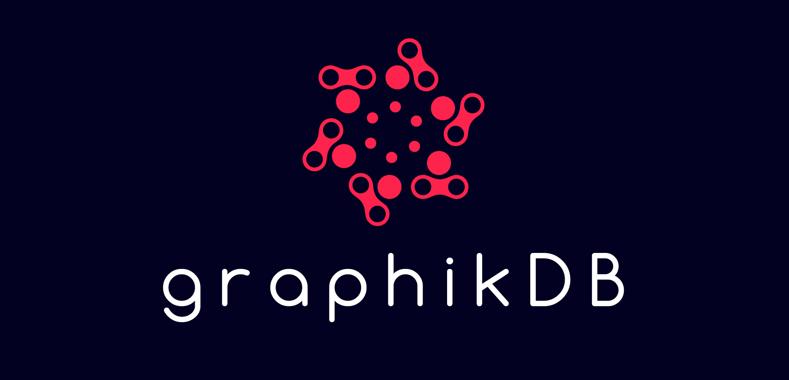
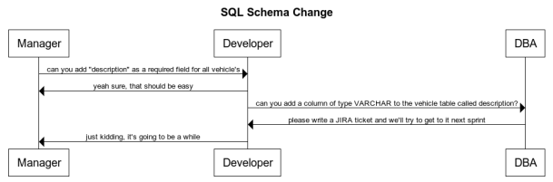
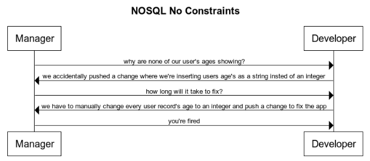

https://graphikdb.github.io/graphik/

[](https://godoc.org/github.com/graphikDB/graphik)

`git clone git@github.com:graphikDB/graphik.git`
    
`docker pull graphikdb/graphik:v1.2.0`

Graphik is a Backend as a Service implemented as an identity-aware, permissioned, persistant document/graph database & pubsub server written in Go.

Support: support@graphikdb.io

- [Problem Statement](#problem-statement)
    + [Traditional relational databases are powerful but come with a number of issues that interfere with agile development methodologies:](#traditional-relational-databases-are-powerful-but-come-with-a-number-of-issues-that-interfere-with-agile-development-methodologies-)
    + [Traditional non-relational databases are non-relational](#traditional-non-relational-databases-are-non-relational)
    + [Traditional non-relational databases often don't have a declarative query language](#traditional-non-relational-databases-often-don-t-have-a-declarative-query-language)
    + [Traditional non-relational databases often don't support custom constraints](#traditional-non-relational-databases-often-don-t-support-custom-constraints)
    + [No awareness of origin/end user accessing the records(only the API/dba making the request)](#no-awareness-of-origin-end-user-accessing-the-records-only-the-api-dba-making-the-request-)
  * [Solution](#solution)
- [Features](#features)
- [Key Dependencies](#key-dependencies)
- [Flags](#flags)
- [gRPC Client SDKs](#grpc-client-sdks)
- [Implemenation Details](#implemenation-details)
  * [Primitives](#primitives)
  * [Identity Graph](#identity-graph)
  * [Login/Authorization/Authorizers](#login-authorization-authorizers)
    + [Authorizers Examples](#authorizers-examples)
  * [Secondary Indexes](#secondary-indexes)
    + [Secondary Index Examples](#secondary-index-examples)
  * [Constraints](#constraints)
    + [Constraint Examples](#constraint-examples)
  * [Triggers](#triggers)
    + [Trigger Examples](#trigger-examples)
  * [GraphQL vs gRPC API](#graphql-vs-grpc-api)
  * [Streaming/PubSub](#streaming-pubsub)
  * [Graphik Playground](#graphik-playground)
  * [Additional Details](#additional-details)
- [Sample GraphQL Queries](#sample-graphql-queries)
  * [Get Currently Logged In User(me)](#get-currently-logged-in-user-me-)
  * [Get the Graph Schema](#get-the-graph-schema)
  * [Set a Request Authorizer](#set-a-request-authorizer)
  * [Create a Document](#create-a-document)
  * [Traverse Documents](#traverse-documents)
  * [Traverse Documents Related to Logged In User](#traverse-documents-related-to-logged-in-user)
  * [Change Streaming](#change-streaming)
  * [Broadcasting a Message](#broadcasting-a-message)
  * [Filtered Streaming](#filtered-streaming)
- [Deployment](#deployment)
  * [Docker-Compose](#docker-compose)
  * [Kubernetes](#kubernetes)
  * [Mac/OSX (Homebrew)](#mac-osx--homebrew-)
- [Open ID Connect Providers](#open-id-connect-providers)
  * [Google](#google)
  * [Microsoft](#microsoft)
  * [Okta](#okta)
  * [Auth0](#auth0)
- [Glossary](#glossary)

## Problem Statement

#### Traditional relational databases are powerful but come with a number of issues that interfere with agile development methodologies:

- [database schema](https://en.wikipedia.org/wiki/Database_schema) setup requires application context & configuration overhead
- database [schema changes are often dangerous](https://wikitech.wikimedia.org/wiki/Schema_changes#Dangers_of_schema_changes) and require skilled administration to pull off without downtime
- [password rotation](https://www.beyondtrust.com/resources/glossary/password-rotation) is burdensome and leads to password sharing/leaks
- user/application passwords are generally stored in an external store(identity provider) causing duplication of passwords(password-sprawl)
- traditional database indexing requires application context in addition to database administration 

Because of these reasons, proper database adminstration requires a skilled database adminstration team(DBA).

This is bad for the following reasons:

- hiring dba's is [costly](https://www.payscale.com/research/US/Job=Database_Administrator_(DBA)/Salary)
- dba's generally have little context of the API accessing the database(only the intricacies of the database itself)
- communication between developers & dba's is slow (meetings & JIRA tickets)



    
    
#### Traditional non-relational databases are non-relational  
- many times developers will utilize a NOSQL database in order to avoid the downsides of traditional relational databases
- this leads to relational APIs being built on non-relational databases

Because of these reasons, APIs often end up developing anti-patterns

- references to related objects/records are embedded within the record itself instead of joined via foreign key
    - as an API scales, the number of relationships will often grow, causing embedded relationships and/or multi-request queries to grow 
- references to related objects/records are stored as foreign keys & joined client-side via multiple requests(slow)

#### Traditional non-relational databases often don't have a declarative query language
- declarative query languages are much easier to build via graphical tooling for since a single query "console" is generally the only requirement. 
- without a declarative query language, interaction with the database often involves complicated forms on a user-interface to gather user input.
- declarative query languages open up database querying to analysts, operators, managers and others with core competencies outside of software programming.

#### Traditional non-relational databases often don't support custom constraints
- constraints are important for ensuring data integrity
- for instance, you may want to apply a constraint to the "age" field of a user to ensure it's greater than 0 and less than 150
- this leads to developers enforcing constraints within the applications themselves, which leads to bugs




#### No awareness of origin/end user accessing the records(only the API/dba making the request)
- database "users" are generally expected to be database administrators and/or another API.
- 3rd party [SSO](https://en.wikipedia.org/wiki/Single_sign-on) integrations are generally non-native
- databases may be secured properly by the dba team while the APIs connecting to them can be insecure depending on the "origin" user

This is bad for the following reasons:
- dba teams falsely assuming their database resources are secured due to insecure APIs
- api teams falsely assuming their api resources are secured due to insecure database administration


### Solution

- a loosely typed Graph database with built in identity awareness via a configured identity provider(Google, Microsoft, Okta, Auth0, etc)
    - relational-oriented benefits of a SQL database
    - non-relational-oriented productivity benefits of a NOSQL database
- zero password management- this is delegated to the configured identity provider
- schema-optional for productivity gains - constraints enforce custom constraints when necessary
- "identity graph" which creates automatically creates connections between users & the database objects the create/modify
    - index-free-adjacency allows insanely fast relational lookups from the POV of the origin user
- fine-grained authorization model to support requests directly from the origin user/public client(user on browser, ios app, android app, etc)
    - enforce role-based-access-control based on attributes found on the profile of the user manged by the identity provider
- graphQL API to support a declarative query language for public clients(user on browser, ios app, android app, etc), data analysts, and database administrators
- graphQL playground for built in, SSO protected user interface for interacting with the database and exploring data outside of software development
- gRPC API for api -> database requests - gRPC tooling server side is more performant & has better tooling
    - auto-generate client SDK's in most languages (python, javascript, csharp, java, go, etc)
- database schema operations managed via integration with state of the art change management/automation tooling - [terraform](https://terraform.io)

## Features
- [x] 100% Go
- [x] Native gRPC Support
- [x] GraphQL Support
- [x] Native Document & Graph Database
- [x] [Index-free Adjacency](https://dzone.com/articles/the-secret-sauce-of-graph-databases)
- [x] Native OAuth/OIDC Support & Single Sign On
- [x] Embedded SSO protected GraphQl Playground
- [x] Persistant(bbolt LMDB)
- [x] Identity-Aware PubSub with Channels & Message Filtering(gRPC & graphQL)
- [x] Change Streams
- [x] [Extended Common Expression Language](https://github.com/graphikDB/trigger#standard-definitionslibrary) Query Filtering
- [x] [Extended Common Expression Language](https://github.com/graphikDB/trigger#standard-definitionslibrary) Request Authorization
- [x] [Extended Common Expression Language](https://github.com/graphikDB/trigger#standard-definitionslibrary) Constraints
- [x] [Extended Common Expression Language](https://github.com/graphikDB/trigger#standard-definitionslibrary) Server Side Triggers
- [x] Loosely-Typed(mongo-esque)
- [x] Horizontal Scalability/HA via Raft Consensus Protocol
- [x] [Prometheus Metrics](https://prometheus.io/)
- [x] [Pprof Metrics](https://blog.golang.org/pprof)
- [x] Safe to Deploy Publicly(with authorizers/tls/constraints/cors)
- [x] Read-Optimized
- [x] Full Text Search Expression Macros/Functions(`startsWith, endsWith, contains`)
- [x] RegularExp Expression Macros/Functions(`matches`)
- [x] Geographic Expression Macros/Functions(`geoDistance`)
- [x] Cryptographic Expression Macros/Functions(`encrypt, decrypt, sha1, sha256, sha3`)
- [x] JWT Expression Macros/Functions(`parseClaims, parseHeader, parseSignature`)
- [x] Collection Expression Macros/Functions(`in, map, filter, exists`)
- [x] String Manipulation Expression Macros/Functions(`replace, join, titleCase, lowerCase, upperCase, trimSpace, trimPrefix, trimSuffix, render`)
- [x] URL Introspection Expression Macros/Functions(`parseHost, parseScheme, parseQuery, parsePath`)
- [x] Client to Server streaming(gRPC only)
- [x] [Terraform Provider](https://github.com/graphikDB/terraform-provider-graphik) for Schema Operations & Change Automation
- [x] [Command Line Interface](https://github.com/graphikDB/graphikctl)
- [x] [Multi-Node Kubernetes Manifest](./k8s.yaml)
- [x] Mutual TLS(optional)

## Key Dependencies

- google.golang.org/grpc
- github.com/google/cel-go/cel
- go.etcd.io/bbolt
- go.uber.org/zap
- golang.org/x/oauth2
- github.com/99designs/gqlgen
- github.com/autom8ter/machine
- github.com/graphikDB/raft
- github.com/graphikDB/generic
- github.com/graphikDB/trigger

## Flags

please note that the following flags are required:
- --root-users
- --open-id

```text
      --allow-headers strings             cors allow headers (env: GRAPHIK_ALLOW_HEADERS) (default [*])
      --allow-methods strings             cors allow methods (env: GRAPHIK_ALLOW_METHODS) (default [HEAD,GET,POST,PUT,PATCH,DELETE])
      --allow-origins strings             cors allow origins (env: GRAPHIK_ALLOW_ORIGINS) (default [*])
      --debug                             enable debug logs (env: GRAPHIK_DEBUG)
      --environment string                deployment environment (k8s) (env: GRAPHIK_ENVIRONMENT)
      --join-raft string                  join raft cluster at target address (env: GRAPHIK_JOIN_RAFT)
      --listen-port int                   serve gRPC & graphQL on this port (env: GRAPHIK_LISTEN_PORT) (default 7820)
      --open-id string                    open id connect discovery uri ex: https://accounts.google.com/.well-known/openid-configuration (env: GRAPHIK_OPEN_ID) (required) 
      --playground-client-id string       playground oauth client id (env: GRAPHIK_PLAYGROUND_CLIENT_ID)
      --playground-client-secret string   playground oauth client secret (env: GRAPHIK_PLAYGROUND_CLIENT_SECRET)
      --playground-redirect string        playground oauth redirect (env: GRAPHIK_PLAYGROUND_REDIRECT) (default "http://localhost:8080/playground/callback")
      --raft-max-pool int                 max nodes in pool (env: GRAPHIK_RAFT_MAX_POOL) (default 5)
      --raft-peer-id string               raft peer ID - one will be generated if not set (env: GRAPHIK_RAFT_PEER_ID)
      --raft-secret string                raft cluster secret (so only authorized nodes may join cluster) (env: GRAPHIK_RAFT_SECRET)
      --require-request-authorizers       require request authorizers for all methods/endpoints (env: GRAPHIK_REQUIRE_REQUEST_AUTHORIZERS)
      --require-response-authorizers      require request authorizers for all methods/endpoints (env: GRAPHIK_REQUIRE_RESPONSE_AUTHORIZERS)
      --root-users strings                a list of email addresses that bypass registered authorizers (env: GRAPHIK_ROOT_USERS)  (required)
      --storage string                    persistant storage path (env: GRAPHIK_STORAGE_PATH) (default "/tmp/graphik")
      --tls-cert string                   path to tls certificate (env: GRAPHIK_TLS_CERT)
      --tls-key string                    path to tls key (env: GRAPHIK_TLS_KEY)
```

## gRPC Client SDKs
- [x] [Go](https://godoc.org/github.com/graphikDB/graphik/graphik-client-go)
- [x] [Python](gen/grpc/python)
- [x] [PHP](gen/grpc/php)
- [x] [Javascript](gen/grpc/js)
- [x] [Java](gen/grpc/java)
- [x] [C#](gen/grpc/csharp)
- [x] [Ruby](gen/grpc/ruby)

## Implemenation Details

- [graphQL Schema](schema.graphql)
- [graphQL Schema Documentation](gen/gql/docs/index.html)
- [gRPC Schema](graphik.proto)
- [gRPC Schema Documentation](gen/grpc/docs/index.html)

### Primitives

- `Ref` == direct pointer to an doc or connection.

```proto
message Ref {
  // gtype is the type of the doc/connection ex: pet
  string gtype =1 [(validator.field) = {regex : "^.{1,225}$"}];
  // gid is the unique id of the doc/connection within the context of it's type
  string gid =2 [(validator.field) = {regex : "^.{1,225}$"}];
}
```

- `Doc` == JSON document in document storage terms AND vertex/node in graph theory

```proto
message Doc {
    // ref is the ref to the doc
    Ref ref =1 [(validator.field) = {msg_exists : true}];
    // k/v pairs
    google.protobuf.Struct attributes =2;
}
```
       
- `Connection` == graph edge/relationship in graph theory. Connections relate Docs to one another.

```proto
message Connection {
  // ref is the ref to the connection
  Ref ref =1 [(validator.field) = {msg_exists : true}];
  // attributes are k/v pairs
  google.protobuf.Struct attributes =2;
  // directed is false if the connection is bi-directional
  bool directed =3;
  // from is the doc ref that is the source of the connection
  Ref from =4 [(validator.field) = {msg_exists : true}];
  // to is the doc ref that is the destination of the connection
  Ref to =5 [(validator.field) = {msg_exists : true}];
}
```

### Identity Graph
- any time a document is created, a connection of type `created` from the origin user to the new document is also created
- any time a document is created, a connection of type `created_by` from the new document to the origin user is also created
- any time a document is edited, a connection of type `edited` from the origin user to the new document is also created(if none exists)
- any time a document is edited, a connection of type `edited_by` from the new document to the origin user is also created(if none exists)
- every document a user has ever interacted with may be queried via the Traverse method with the user as the root document of the traversal

### Login/Authorization/Authorizers
- an access token `Authorization: Bearer ${token}` from the configured open-id connect identity provider is required for all database functionality
- the access token is used to fetch the users info from the oidc userinfo endpoint fetched from the oidc metadata url
- if a user is not present in the database, one will be automatically created under the gtype: `user` with their email address as their `gid`
- once the user is fetched, it is evaluated(along with the request & request method) against any registered authorizers(CEL expression) in the database.
    - if an authorizer evaluates false, the request will be denied
    - authorizers may be used to restrict access to functionality by domain, role, email, etc
    - registered root users(see flags) bypass these authorizers
- authorizers are completely optional but highly recommended

please note:

- setAuthorizers method overwrites all authorizers in the database
- authorizers may be listed with the getSchema method

#### Authorizers Examples

1) only allow access to the GetSchema method if the users email contains `coleman` AND their email is verified

```graphql
mutation {
  setAuthorizers(input: {
    authorizers: [{
      name: "getSchema",
      method: "/api.DatabaseService/GetSchema",
      expression: "this.user.attributes.email.contains('coleman') && this.user.attributes.email_verified"
      target_requests:true,
      target_responses: true
    }]
  })
}
```

2) only allow access to the CreateDoc method if the users email endsWith acme.com AND the users email is verified AND the doc to create is of type note

```graphql
mutation {
  setAuthorizers(input: {
    authorizers: [{
      name: "createNote",
      method: "/api.DatabaseService/CreateDoc",
      expression: "this.user.attributes.email.endsWith('acme.com') && this.user.attributes.email_verified && this.target.ref.gtype == 'note'"
      target_requests:true,
      target_responses: false
    }]
  })
}
```


### Secondary Indexes
- secondary indexes are CEL expressions evaluated against a particular type of Doc or Connection
- indexes may be used to speed up queries that iterate over a large number of elements
- secondary indexes are completely optional but recommended

please note:

- setIndexes method overwrites all indexes in the database
- indexes may be listed with the getSchema method

#### Secondary Index Examples

1) index documents of type `product` that have a price > 100

```graphql
mutation {
  setIndexes(input: {
    indexes: [{
    	name: "expensiveProducts"
			gtype: "product"
			expression: "int(this.attributes.price) > 100"
			target_docs: true
			target_connections: false
    }]
  })
}
```

you can search for the document within the new index like so:

```graphql
query {
	searchDocs(where: {
		gtype: "product"
		limit: 1
		index: "expensiveProducts"
	}){
		docs {
			ref {
				gid
				gtype
			}
			attributes
		}
	}
}
```

```json
{
  "data": {
    "searchDocs": {
      "docs": [
        {
          "ref": {
            "gid": "1lw7gcc5yQ01YbLcsgMX0iz0Sgx",
            "gtype": "product"
          },
          "attributes": {
            "price": 101,
            "title": "this is a product"
          }
        }
      ]
    }
  },
  "extensions": {}
}
```

### Constraints
- constraints are CEL expressions evaluated against a particular type of Doc or Connection to enforce custom constraints
- constraints are completely optional

please note:

- setConstraints overwrites all constraints in the database
- constraints may be listed with the getSchema method

#### Constraint Examples

1) ensure all documents of type 'note' have a title

```graphql
mutation {
  setConstraints(input: {
    constraints: [{
    	name: "noteValidator"
			gtype: "note"
			expression: "this.attributes.title != ''"
			target_docs: true
			target_connections: false
    }]
  })
}
```

2) ensure all documents of type 'product' have a price greater than 0

```graphql
mutation {
  setConstraints(input: {
    constraints: [{
    	name: "productValidator"
			gtype: "product"
			expression: "int(this.attributes.price) > 0"
			target_docs: true
			target_connections: false
    }]
  })
}
```

### Triggers

- triggers may be used to automatically mutate the attributes of documents/connections before they are commited to the database
- this is useful for automatically annotating your data without having to make additional client-side requests

#### Trigger Examples

1) automatically add updated_at & created_at timestamp to all documents & connections

```graphql
mutation {
	setTriggers(input: {
		triggers: [
		{
				name: "updatedAt"
				gtype: "*"
				expression: "true"
				trigger: "{'updated_at': now()}"
				target_docs: true
				target_connections: true
		},
		{
				name: "createdAt"
				gtype: "*"
				expression: "!has(this.attributes.created_at)"
				trigger: "{'created_at': now()}"
				target_docs: true
				target_connections: true
		},
		]
	})
}
```

```json
{
  "data": {
    "setTriggers": {}
  },
  "extensions": {}
}
```

## User Interface

Please take a look at the following options for stategate user-interface clients:

- [OAuth GraphQL Playground](https://github.com/autom8ter/oauth-graphql-playground): A graphQL IDE that may be used to connect & interact with the full functionality of the stategate graphQL API as an authenticated user

### GraphQL vs gRPC API

In my opinion, gRPC is king for svc-svc communication & graphQL is king for developing user interfaces & exploring data.

In graphik the graphQL & gRPC are nearly identical, but every request flows through the gRPC server natively - 
the graphQL api is technically a wrapper that may be used for developing user interfaces & querying the database from the graphQL playground.

The gRPC server is more performant so it is advised that you import one of the gRPC client libraries as opposed to utilizing the graphQL endpoint when developing backend APIs.

The graphQL endpoint is particularly useful for developing public user interfaces against since it can be locked down to nearly any extent via authorizers, cors, constraints, & tls.

### Streaming/PubSub

Graphik supports channel based pubsub as well as change-based streaming. 

All server -> client stream/subscriptions are started via the Stream() endpoint in gRPC or graphQL.
All messages received on this channel include the user that triggered/sent the message.
Messages on channels may be filtered via CEL expressions so that only messages are pushed to clients that they want to receive.
Messages may be sent directly to channels via the Broadcast() method in gRPC & graphQL.
All state changes in the graph are sent by graphik to the `state` channel which may be subscribed to just like any other channel.

### Graphik Playground

If the following environmental variables/flags are set, an SSO protected graphQL playground will be served on /playground
```..env
GRAPHIK_PLAYGROUND_CLIENT_ID=${client_id} # the oauth2 application/client id
GRAPHIK_PLAYGROUND_CLIENT_SECRET=${client_secret} # the oauth2 application/client secret
GRAPHIK_PLAYGROUND_REDIRECT=${playground_redirect} # the oauth2 authorization code redirect: the playground exposes an endpoint to handle this redirect /playground/callback
```


### Additional Details
- any time a Doc is deleted, so are all of its connections

## Sample GraphQL Queries

### Get Currently Logged In User(me)

```graphql
query {
  me(where: {}) {
    ref {
      gid
      gtype
    }
		attributes
  }
}
```

```json
{
  "data": {
    "me": {
      "ref": {
        "gid": "coleman.word@graphikdb.io",
        "gtype": "user"
      },
      "attributes": {
        "email": "coleman.word@graphikdb.io",
        "email_verified": true,
        "family_name": "Word",
        "given_name": "Coleman",
        "hd": "graphikdb.io",
        "locale": "en",
        "name": "Coleman Word",
        "picture": "https://lh3.googleusercontent.com/--LNU8XICB1A/AAAAAAAAAAI/AAAAAAAAAAA/AMZuuckp6gwH9JVkhlRkk-PTZdyDFctArg/s96-c/photo.jpg",
        "sub": "105138978122958973720"
      }
    }
  },
  "extensions": {}
}
```


### Get the Graph Schema

```graphql
query {
  getSchema(where: {}) {
    doc_types
		connection_types
    authorizers {
      authorizers {
        name
        expression
      }
    }
		constraints {
			constraints {
				name
				expression
			}
		}
		indexes {
			indexes {
				name
				expression
			}
		}
  }
}
```

```json
{
  "data": {
    "getSchema": {
      "doc_types": [
        "dog",
        "human",
        "note",
        "user"
      ],
      "connection_types": [
        "created",
        "created_by",
        "edited",
        "edited_by",
        "owner"
      ],
      "authorizers": {
        "authorizers": [
          {
            "name": "testing",
            "expression": "this.user.attributes.email.contains(\"coleman\")"
          }
        ]
      },
      "constraints": {
        "constraints": [
          {
            "name": "testing",
            "expression": "this.user.attributes.email.contains(\"coleman\")"
          }
        ]
      },
      "indexes": {
        "indexes": [
          {
            "name": "testing",
            "expression": "this.attributes.primary_owner"
          }
        ]
      }
    }
  },
  "extensions": {}
}
```

### Set a Request Authorizer

```graphql
mutation {
  setAuthorizers(input: {
    authorizers: [{
      name: "testing",
      method: "/api.DatabaseService/GetSchema",
      expression: "this.user.attributes.email.contains('coleman') && this.user.attributes.email_verified"
      target_requests:true,
      target_responses: true
    }]
  })
}
```

```json
{
  "data": {
    "setAuthorizers": {}
  },
  "extensions": {}
}
```

### Create a Document

```graphql
mutation {
  createDoc(input: {
    ref: {
  		gtype: "note"
    }
    attributes: {
      title: "do the dishes"
    }
  }){
    ref {
      gid
      gtype
    }
    attributes
  }
}
```

```json
{
  "data": {
    "createDoc": {
      "ref": {
        "gid": "1lU0w0QjiI0jnNL8XMzWJHqQmTd",
        "gtype": "note"
      },
      "attributes": {
        "title": "do the dishes"
      }
    }
  },
  "extensions": {}
}
```

### Traverse Documents

```graphQL
# Write your query or mutation here
query {
  traverse(input: {
    root: {
      gid: "coleman.word@graphikdb.io"
      gtype: "user"
    }
    algorithm: BFS
    limit: 6
		max_depth: 1
		max_hops: 10
  }){
    traversals {
      doc {
        ref {
          gid
          gtype
        }
      }
      traversal_path {
        gid
        gtype
      }
			depth
			hops
    }
  }
}
```

### Traverse Documents Related to Logged In User

```graphql
query {
	traverseMe(where: {
		max_hops: 100
		max_depth:1
		limit: 5
	}){
		traversals {
			traversal_path {
				gtype
				gid
			}
			depth
			hops
			doc {
				ref {
					gid
					gtype
				}
			}
		}
	}
}
```

```json
{
  "data": {
    "traverseMe": {
      "traversals": [
        {
          "traversal_path": null,
          "depth": 0,
          "hops": 0,
          "doc": {
            "ref": {
              "gid": "coleman.word@graphikdb.io",
              "gtype": "user"
            }
          }
        },
        {
          "traversal_path": [
            {
              "gtype": "user",
              "gid": "coleman.word@graphikdb.io"
            }
          ],
          "depth": 1,
          "hops": 1,
          "doc": {
            "ref": {
              "gid": "1lU0w0QjiI0jnNL8XMzWJHqQmTd",
              "gtype": "note"
            }
          }
        }
      ]
    }
  },
  "extensions": {}
}
```

### Change Streaming

```graphql
subscription {
	stream(where: {
		channel: "state"
	}){
		data
		user {
			gid
			gtype
		}
	}
}
```

```json
{
  "data": {
    "stream": {
      "data": {
        "attributes": {
          "title": "do the dishes"
        },
        "ref": {
          "gid": "1lUAK3uwwmhQ503ByzC9nCvdH6W",
          "gtype": "note"
        }
      },
      "user": {
        "gid": "coleman.word@graphikdb.io",
        "gtype": "user"
      }
    }
  },
  "extensions": {}
}
```

### Broadcasting a Message

```graphql
mutation {
  broadcast(input: {
    channel: "testing"
    data: {
      text: "hello world!"
    }
  })
}
```

```json
{
  "data": {
    "broadcast": {}
  },
  "extensions": {}
}
```

### Filtered Streaming

```graphql
subscription {
  stream(where: {
    channel: "testing"
		expression: "this.data.text == 'hello world!' && this.user.gid.endsWith('graphikdb.io')"
    
  }){
    data
		user {
			gid
			gtype
		}
  }
}
```

```json
{
  "data": {
    "stream": {
      "data": {
        "text": "hello world!"
      },
      "user": {
        "gid": "coleman.word@graphikdb.io",
        "gtype": "user"
      }
    }
  },
  "extensions": {}
}
```

## Deployment

Regardless of deployment methodology, please set the following environmental variables or include them in a ${pwd}/.env file

```
GRAPHIK_PLAYGROUND_CLIENT_ID=${client_id}
GRAPHIK_PLAYGROUND_CLIENT_SECRET=${client_secret}
GRAPHIK_PLAYGROUND_REDIRECT=http://localhost:7820/playground/callback
GRAPHIK_OPEN_ID=${open_id_connect_metadata_url}
#GRAPHIK_ALLOW_HEADERS=${cors_headers}
#GRAPHIK_ALLOW_METHOD=${cors_methos}
#GRAPHIK_ALLOW_ORIGINS=${cors_origins}
#GRAPHIK_ROOT_USERS=${root_users}
#GRAPHIK_TLS_CERT=${tls_cert_path}
#GRAPHIK_TLS_KEY=${tls_key_path}
```

### Docker-Compose

add this docker-compose.yml to ${pwd}:

    version: '3.7'
    services:
      graphik:
        image: graphikdb/graphik:v1.2.0
        env_file:
          - .env
        ports:
          - "7820:7820"
          - "7821:7821"
        volumes:
          - default:/tmp/graphik
        networks:
          default:
            aliases:
              - graphikdb
    networks:
      default:
    
    volumes:
      default:

    
then run:

    docker-compose -f docker-compose.yml pull
    docker-compose -f docker-compose.yml up -d
    
to shutdown:
    
    docker-compose -f docker-compose.yml down --remove-orphans
    
 ### Kubernetes(Multi-Node)
 
Given a running Kubernetes cluster, run:

```yaml
curl https://raw.githubusercontent.com/graphikDB/graphik/master/k8s.yaml >> k8s.yaml && \
  kubectl apply -f k8s.yaml

```

to view pods as they spin up, run:

    kubectl get pods -n graphik -w

graphik plugs into kubernetes service discovery 
 
 ### Mac/OSX (Homebrew)
 
    brew tap graphik/tools git@github.com:graphikDB/graphik-homebrew.git
    
    brew install graphik
    
    brew install graphikctl
 
## Open ID Connect Providers

### Google

- metadata uri: https://accounts.google.com/.well-known/openid-configuration

### Microsoft

- metadata uri: [See More](https://docs.microsoft.com/en-us/azure/active-directory/develop/v2-protocols-oidc)

### Okta

- metadata uri: https://${yourOktaOrg}/.well-known/openid-configuration [See More](https://developer.okta.com/docs/concepts/auth-servers/)

### Auth0

- metadata uri: https://${YOUR_DOMAIN}/.well-known/openid-configuration [See More](https://auth0.com/docs/protocols/configure-applications-with-oidc-discovery)


## Glossary

|Term                                  |Definition                                                                                                                                                                                                                                                                                                                                                                                                                                                                                               |Source                                                                                                                                                                                           |
|--------------------------------------|---------------------------------------------------------------------------------------------------------------------------------------------------------------------------------------------------------------------------------------------------------------------------------------------------------------------------------------------------------------------------------------------------------------------------------------------------------------------------------------------------------|-------------------------------------------------------------------------------------------------------------------------------------------------------------------------------------------------|
|Application Programming Interface(API)|An application programming interface (API) is a computing interface that defines interactions between multiple software intermediaries. It defines the kinds of calls or requests that can be made, how to make them, the data formats that should be used, the conventions to follow, etc.                                                                                                                                                                                                              |https://en.wikipedia.org/wiki/API#:~:text=An%20application%20programming%20interface%20(API,the%20conventions%20to%20follow%2C%20etc.                                                            |
|Structured Query Language(SQL)        |a domain-specific language used in programming and designed for managing data held in a relational database management system (RDBMS), or for stream processing in a relational data stream management system (RDSMS). It is particularly useful in handling structured data, i.e. data incorporating relations among entities and variables.                                                                                                                                                            |https://en.wikipedia.org/wiki/SQL                                                                                                                                                                |
|NOSQL                                 |(originally referring to "non-SQL" or "non-relational") database provides a mechanism for storage and retrieval of data that is modeled in means other than the tabular relations used in relational databases                                                                                                                                                                                                                                                                                           |https://en.wikipedia.org/wiki/NoSQL                                                                                                                                                              |
|Graph Database                        |Very simply, a graph database is a database designed to treat the relationships between data as equally important to the data itself. It is intended to hold data without constricting it to a pre-defined model. Instead, the data is stored like we first draw it out - showing how each individual entity connects with or is related to others.                                                                                                                                                      |https://neo4j.com/developer/graph-database/                                                                                                                                                      |
|Identity Provider                     |An identity provider (abbreviated IdP or IDP) is a system entity that creates, maintains, and manages identity information for principals and also provides authentication services to relying applications within a federation or distributed network.                                                                                                                                                                                                                                                  |https://en.wikipedia.org/wiki/Identity_provider                                                                                                                                                  |
|OAuth2                                |The OAuth 2.0 authorization framework enables a third-party                                                                                                                                                                                                                                                                                                                                                                                                                                              |https://tools.ietf.org/html/rfc6749                                                                                                                                                              |
|Open ID Connect(OIDC)                 |application to obtain limited access to an HTTP service, either on behalf of a resource owner by orchestrating an approval interaction between the resource owner and the HTTP service, or by allowing the third-party application to obtain access on its own behalf.                                                                                                                                                                                                                                   |https://en.wikipedia.org/wiki/OpenID_Connect                                                                                                                                                     |
|Open ID Connect Provider Metadata     |OpenID Providers supporting Discovery MUST make a JSON document available at the path formed by concatenating the string /.well-known/openid-configuration to the Issuer.                                                                                                                                                                                                                                                                                                                                |https://openid.net/specs/openid-connect-discovery-1_0.html#ProviderMetadata                                                                                                                      |
|gRPC                                  |gRPC is a modern open source high performance RPC framework that can run in any environment. It can efficiently connect services in and across data centers with pluggable support for load balancing, tracing, health checking and authentication. It is also applicable in last mile of distributed computing to connect devices, mobile applications and browsers to backend services.                                                                                                                |https://grpc.io/                                                                                                                                                                                 |
|graphQL                               |GraphQL is a query language for APIs and a runtime for fulfilling those queries with your existing data. GraphQL provides a complete and understandable description of the data in your API, gives clients the power to ask for exactly what they need and nothing more, makes it easier to evolve APIs over time, and enables powerful developer tools.                                                                                                                                                 |https://graphql.org/                                                                                                                                                                             |
|Client-Server Model                   |Client–server model is a distributed application structure that partitions tasks or workloads between the providers of a resource or service, called servers, and service requesters, called clients.                                                                                                                                                                                                                                                                                                    |https://en.wikipedia.org/wiki/Client%E2%80%93server_model                                                                                                                                        |
|Publish-Subscribe Architecture(PubSub)|In software architecture, publish–subscribe is a messaging pattern where senders of messages, called publishers, do not program the messages to be sent directly to specific receivers, called subscribers, but instead categorize published messages into classes without knowledge of which subscribers, if any, there may be. Similarly, subscribers express interest in one or more classes and only receive messages that are of interest, without knowledge of which publishers, if any, there are.|https://en.wikipedia.org/wiki/Publish%E2%80%93subscribe_pattern                                                                                                                                  |
|Database Administrator                |Database administrators ensure databases run efficiently. Database administrators use specialized software to store and organize data, such as financial information and customer shipping records. They make sure that data are available to users and secure from unauthorized access.                                                                                                                                                                                                                 |https://www.bls.gov/ooh/computer-and-information-technology/database-administrators.htm#:~:text=Database%20administrators%20ensure%20databases%20run,and%20secure%20from%20unauthorized%20access.|
|Raft                                  |Raft is a consensus algorithm designed as an alternative to the Paxos family of algorithms. It was meant to be more understandable than Paxos by means of separation of logic, but it is also formally proven safe and offers some additional features.[1] Raft offers a generic way to distribute a state machine across a cluster of computing systems, ensuring that each node in the cluster agrees upon the same series of state transitions.                                                       |https://en.wikipedia.org/wiki/Raft_(algorithm)                                                                                                                                                   |
|Raft Leader                           |At any given time, the peer set elects a single node to be the leader. The leader is responsible for ingesting new log entries, replicating to followers, and managing when an entry is considered committed.                                                                                                                                                                                                                                                                                            |https://www.consul.io/docs/architecture/consensus                                                                                                                                                |
|Raft Quorum                           |A quorum is a majority of members from a peer set: for a set of size N, quorum requires at least (N/2)+1 members. For example, if there are 5 members in the peer set, we would need 3 nodes to form a quorum. If a quorum of nodes is unavailable for any reason, the cluster becomes unavailable and no new logs can be committed.                                                                                                                                                                     |https://www.consul.io/docs/architecture/consensus                                                                                                                                                |
|Raft Log                              |The primary unit of work in a Raft system is a log entry. The problem of consistency can be decomposed into a replicated log. A log is an ordered sequence of entries. Entries includes any cluster change: adding nodes, adding services, new key-value pairs, etc. We consider the log consistent if all members agree on the entries and their order.                                                                                                                                                 |https://www.consul.io/docs/architecture/consensus                                                                                                                                                |
|High Availability                     |High availability (HA) is a characteristic of a system which aims to ensure an agreed level of operational performance, usually uptime, for a higher than normal period.                                                                                                                                                                                                                                                                                                                                 |https://en.wikipedia.org/wiki/High_availability#:~:text=High%20availability%20(HA)%20is%20a,increased%20reliance%20on%20these%20systems.                                                         |
|Horizontal Scaleability               |Horizontal scaling means scaling by adding more machines to your pool of resources (also described as “scaling out”), whereas vertical scaling refers to scaling by adding more power (e.g. CPU, RAM) to an existing machine (also described as “scaling up”).                                                                                                                                                                                                                                           |https://www.section.io/blog/scaling-horizontally-vs-vertically/#:~:text=Horizontal%20scaling%20means%20scaling%20by,as%20%E2%80%9Cscaling%20up%E2%80%9D).                                        |
|Database Trigger                      |A database trigger is procedural code that is automatically executed in response to certain events on a particular table or view in a database                                                                                                                                                                                                                                                                                                                                                           |https://en.wikipedia.org/wiki/Database_trigger                                                                                                                                                   |
|Secondary Index                       |A secondary index, put simply, is a way to efficiently access records in a database (the primary) by means of some piece of information other than the usual (primary) key.                                                                                                                                                                                                                                                                                                                              |https://docs.oracle.com/cd/E17275_01/html/programmer_reference/am_second.html#:~:text=A%20secondary%20index%2C%20put%20simply,the%20usual%20(primary)%20key.                                     |
|Authentication vs Authorization       |Authentication and authorization might sound similar, but they are distinct security processes in the world of identity and access management (IAM). Authentication confirms that users are who they say they are. Authorization gives those users permission to access a resource.                                                                                                                                                                                                                      |https://www.okta.com/identity-101/authentication-vs-authorization/#:~:text=Authentication%20and%20authorization%20might%20sound,permission%20to%20access%20a%20resource.                         |
|Role Based Access Control(RBAC)       |Role-based access control (RBAC) is a method of restricting network access based on the roles of individual users within an enterprise. RBAC lets employees have access rights only to the information they need to do their jobs and prevents them from accessing information that doesn't pertain to them.                                                                                                                                                                                             |https://searchsecurity.techtarget.com/definition/role-based-access-control-RBAC#:~:text=Role%2Dbased%20access%20control%20(RBAC)%20is%20a%20method%20of,doesn't%20pertain%20to%20them.           |
| Index Free Adjacency | Data lookup performance is dependent on the access speed from one particular node to another. Because index-free adjacency enforces the nodes to have direct physical RAM addresses and physically point to other adjacent nodes, it results in a fast retrieval. A native graph system with index-free adjacency does not have to move through any other type of data structures to find links between the nodes. | https://en.wikipedia.org/wiki/Graph_database#Index-free_adjacency
| Extended Common Expression Language | An extensive decision & trigger framework backed by Google's Common Expression Language | https://github.com/graphikDB/trigger#standard-definitionslibrary
