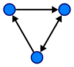
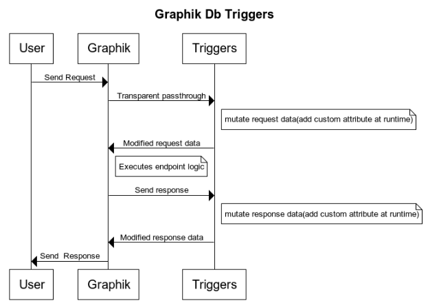

# Graphik



    git clone git@github.com:autom8ter/graphik.git
    
    docker pull colemanword/graphik:v0.0.9

Graphik is an identity-aware, permissioned, persistant [labelled property graph](https://en.wikipedia.org/wiki/Graph_database#Labeled-property_graph) database written in Go

  * [Helpful Links](#helpful-links)
  * [Features](#features)
  * [Key Dependencies](#key-dependencies)
  * [API Spec](#api-spec)
  * [Flags](#flags)
  * [Triggers (optional)](#triggers--optional-)
  * [Roadmap](#roadmap)
  * [Example Graphql Queries](#example-graphql-queries)


## Helpful Links

- [API Spec](https://github.com/autom8ter/graphik/blob/master/api/graphik.proto)
- [Common Expression Language](https://opensource.google/projects/cel) Query Filtering
- [CEL Standard Functions/Definitions](https://github.com/google/cel-spec/blob/master/doc/langdef.md#standard-definitions)
- [Directed Graph Wiki](https://en.wikipedia.org/wiki/Directed_graph)

## Client SDKs

- [graphik-client-go](https://github.com/autom8ter/graphik-client-go)

## Features

- [x] 100% Go
- [x] Native gRPC & GraphQl Support
- [x] Built in GraphQl Playground
- [x] Native OAuth Support & Single Sign On
- [x] Persistant(bbolt LMDB)
- [x] Channel Based PubSub
- [x] Change Stream Subscriptions
- [x] [Common Expression Language](https://opensource.google/projects/cel) Query Filtering
- [x] [Common Expression Language](https://opensource.google/projects/cel) Request Authorization
- [x] gRPC Based External [Triggers](#triggers--optional-)
- [x] Object metadata - Auto track created/updated timestamps & who is making updates to objects
- [x] Loosely-Typed(mongo-esque)
- [x] [Prometheus Metrics](https://prometheus.io/)
- [x] [Pprof Metrics](https://blog.golang.org/pprof)
- [x] Secure JWT based auth with remote [JWKS](https://auth0.com/docs/tokens/json-web-tokens/json-web-key-sets) support
- [x] Auto JWKS refresh
- [x] Bulk Export
- [x] Bulk Import

## Key Dependencies

- google.golang.org/grpc
- github.com/autom8ter/machine
- github.com/google/cel-go/cel
- go.etcd.io/bbolt
- go.uber.org/zap
- golang.org/x/oauth2
- github.com/99designs/gqlgen

## API Spec

```proto
// GraphService is the primary Graph service
service GraphService {
  // Ping returns PONG if the server is health
  rpc Ping(google.protobuf.Empty) returns(Pong) {}
  // GetSchema gets schema about the Graph node & edge types
  rpc GetSchema(google.protobuf.Empty) returns(Schema){}
 // Me returns a NodeDetail of the currently logged in identity(the subject of the JWT)
  rpc Me(MeFilter) returns(NodeDetail){}
  // CreateNode creates a node in the graph
  rpc CreateNode(NodeConstructor) returns(Node){}
  // CreateNodes creates a batch of nodes in the graph
  rpc CreateNodes(NodeConstructors) returns(Nodes){}
  // GetNode gets a single node in the graph
  rpc GetNode(Path) returns(Node){}
  // SearchNodes searches the graph for nodes
  rpc SearchNodes(Filter) returns(Nodes){}
  // PatchNode patches a nodes attributes
  rpc PatchNode(Patch) returns(Node){}
  // PatchNodes patches a batch of nodes attributes
  rpc PatchNodes(Patches) returns(Nodes){}
  // DelNode deletes a node from the graph
  rpc DelNode(Path) returns(google.protobuf.Empty){}
  // DelNodes deletes a batch of nodes from the graph
  rpc DelNodes(Paths) returns(google.protobuf.Empty){}
  // CreateEdge creates an edge in the graph
  rpc CreateEdge(EdgeConstructor) returns(Edge){}
  // CreateEdges creates a batch of edges in the graph
  rpc CreateEdges(EdgeConstructors) returns(Edges){}
  // GetEdge gets a single edge in the graph
  rpc GetEdge(Path) returns(Edge){}
  // SearchEdges searches the graph for edges
  rpc SearchEdges(Filter) returns(Edges){}
  // PatchEdge patches an edges attributes
  rpc PatchEdge(Patch) returns(Edge){}
  // PatchEdges patches a batch of edges attributes
  rpc PatchEdges(Patches) returns(Edges){}
  // DelEdge deletes an edge from the graph
  rpc DelEdge(Path) returns(google.protobuf.Empty){}
  // DelEdges deletes a batch of edges from the graph
  rpc DelEdges(Paths) returns(google.protobuf.Empty){}
  // EdgesFrom returns edges that source from the given node path that pass the filter
  rpc EdgesFrom(EdgeFilter) returns(Edges){}
  // EdgesTo returns edges that point to the given node path that pass the filter
  rpc EdgesTo(EdgeFilter) returns(Edges){}
  // Publish publishes a message to a pubsub channel
  rpc Publish(OutboundMessage) returns(google.protobuf.Empty){}
  // Subscribe subscribes to messages on a pubsub channel
  rpc Subscribe(ChannelFilter) returns(stream Message){}
  // Import imports the Graph into the database
  rpc Import(Graph) returns(Graph){}
  // Export returns the Graph data
  rpc Export(google.protobuf.Empty) returns (Graph){}
  // SubGraph returns a subgraph using the given filter
  rpc SubGraph(SubGraphFilter) returns(Graph){}
  // Shutdown shuts down the database
  rpc Shutdown(google.protobuf.Empty) returns(google.protobuf.Empty){}
}
```


## Flags

```text
      --allow-headers strings   cors allow headers (env: GRAPHIK_ALLOW_HEADERS) (default [*])
      --allow-methods strings   cors allow methods (env: GRAPHIK_ALLOW_METHODS) (default [HEAD,GET,POST,PUT,PATCH,DELETE])
      --allow-origins strings   cors allow origins (env: GRAPHIK_ALLOW_ORIGINS) (default [*])
      --authorizers strings     registered authorizers (env: GRAPHIK_AUTHORIZERS)
      --jwks strings            authorized jwks uris ex: https://www.googleapis.com/oauth2/v3/certs (env: GRAPHIK_JWKS_URIS)
      --metrics                 enable prometheus & pprof metrics (emv: GRAPHIK_METRICS = true)
      --storage string          persistant storage path (env: GRAPHIK_STORAGE_PATH) (default "/tmp/graphik")
      --triggers strings        registered triggers (env: GRAPHIK_TRIGGERS)

```

## Triggers (optional)




Graphik triggers are custom, single-method, grpc-based sidecars that the Graphik server integrates with. 
This pattern is similar to Envoy external filters & Kubernetes mutating webhooks / admission controller

Trigger API Spec:

```proto
// TriggerService is an optional/custom external plugin that when added to a graphik instance, mutates requests & responses at runtime
service TriggerService {
  // Ping returns PONG if the server is health
  rpc Ping(google.protobuf.Empty) returns(Pong) {}
  // Mutate mutates request/responses
  rpc Mutate(Interception) returns(Interception){}
  // Match returns a set of expressions used to determine whether the request/response will be sent to the Mutation function.
  // These expressions are cached by the Graphik server
  rpc Match(google.protobuf.Empty) returns(TriggerMatch){}
}
```

Example:

```go
    ctx, cancel := context.WithTimeout(context.Background(), 5*time.Second)
    defer cancel()
    triggerFn := func(ctx context.Context, trigger *apipb.Interception) (*apipb.Interception, error) {
    	if ptypes.Is(trigger.Request, &apipb.NodeConstructor{}) {
    		constructor := &apipb.NodeConstructor{}
    		if err := ptypes.UnmarshalAny(trigger.Request, constructor); err != nil {
    			return nil, err
    		}
    		constructor.GetAttributes().Fields["testing"] = structpb.NewBoolValue(true)
    		nything, err := ptypes.MarshalAny(constructor)
    		if err != nil {
    			return nil, err
    		}
    		trigger.Request = nything
    	}
    	return trigger, nil
    }
    trigger := graphik.NewTrigger(triggerFn, []string{
    	`attributes.name.contains("Bob")`,
    })
    trigger.Serve(ctx, &flags.PluginFlags{
    	BindGrpc: ":8080",
    	BindHTTP: ":8081",
    	Metrics:  true,
    })
```

## Roadmap

- [ ] Encryption At Rest
- [ ] Fault-Tolerance/Horizontal Scaleability(Raft protocol)
- [ ] Graphql API Gateway w/ Graphql GUI
- [ ] Kubernetes Operator
- [ ] Helm Chart


## Example GraphQL Queries

Ping

```graphql
query {
  ping(input: {}) {
    message
  }
}

"""
{
  "data": {
    "ping": {
      "message": "PONG"
    }
  }
}
"""
```

Get Schema

```graphql
query {
  getSchema(input: {}) {
    node_types
    edge_types
  }
}

"""
{
  "data": {
    "getSchema": {
      "node_types": [
        "cat",
        "dog",
        "human",
        "identity"
      ],
      "edge_types": [
        "owner"
      ]
    }
  }
}
"""
```
Create Node
```graphql
mutation {
  createNode(input: {
    path: {
      gtype: "cat"
    }
  	attributes: {
      name: "pippen"
    }
  }){
    attributes
  }
}
```

Get Node
```graphql
query {
  getNode(input: {
    gtype: "identity",
    gid: "107146673535247272789"
  }){
   	path {
      gid
      gtype
    }
    attributes
    metadata {
      created_at
      
    }
  }
}
```

Search Nodes
```graphql
query {
  searchNodes(input: {
    gtype: "identity",
    expressions: ["attributes.email.contains('coleman')"]
    limit: 1
  }){
   	nodes {
      attributes
    }
  }
}
```