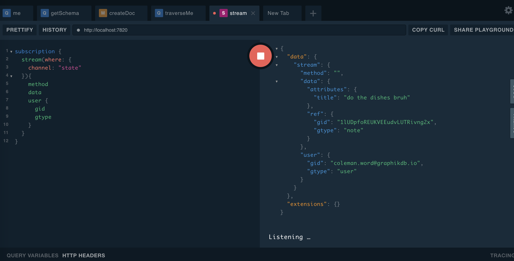

# Graphik


[](https://godoc.org/github.com/graphikDB/graphik)

    git clone git@github.com:graphikDB/graphik.git
    
`    docker pull graphikdb/graphik:v0.11.0`

Graphik is a Backend as a Service implemented as an identity-aware, permissioned, persistant document/graph database & pubsub server written in Go.

Support: support@graphikdb.io

  * [Helpful Links](#helpful-links)
  * [Features](#features)
  * [Key Dependencies](#key-dependencies)
  * [Flags](#flags)
  * [gRPC Client SDKs](#grpc-client-sdks)
  * [Implemenation Details](#implemenation-details)
    + [Primitives](#primitives)
    + [Login/Authorization/Authorizers](#login-authorization-authorizers)
      - [Authorizers Examples](#authorizers-examples)
    + [Secondary Indexes](#secondary-indexes)
      - [Secondary Index Examples](#secondary-index-examples)
    + [Type Validators](#type-validators)
      - [Type Validator Examples](#type-validator-examples)
    + [Triggers](#triggers)
      - [Trigger Examples](#trigger-examples)
    + [Identity Graph](#identity-graph)
    + [GraphQL vs gRPC API](#graphql-vs-grpc-api)
    + [Streaming/PubSub](#streaming-pubsub)
    + [Graphik Playground](#graphik-playground)
    + [Additional Details](#additional-details)
  * [Sample GraphQL Queries](#sample-graphql-queries)
    + [Get Currently Logged In User(me)](#get-currently-logged-in-user-me-)
    + [Get the Graph Schema](#get-the-graph-schema)
    + [Set a Request Authorizer](#set-a-request-authorizer)
    + [Create a Document](#create-a-document)
    + [Traverse Documents](#traverse-documents)
    + [Traverse Documents Related to Logged In User](#traverse-documents-related-to-logged-in-user)
    + [Change Streaming](#change-streaming)
    + [Broadcasting a Message](#broadcasting-a-message)
    + [Filtered Streaming](#filtered-streaming)
  * [Deployment](#deployment)
    + [Docker-Compose](#docker-compose)
    + [Kubernetes](#kubernetes)
  * [OIDC Metadata Urls](#oidc-metadata-urls)

## Helpful Links

- [GraphQL Documentation Site](https://graphikdb.github.io/graphik/)
- [Protobuf/gRPC API Spec](https://github.com/graphikDB/graphik/blob/master/graphik.proto)
- [Graphql API Spec](https://github.com/graphikDB/graphik/blob/master/schema.graphQL)
- [Common Expression Language Code Lab](https://codelabs.developers.google.com/codelabs/cel-go/index.html#0)
- [CEL Standard Functions/Definitions](https://github.com/google/cel-spec/blob/master/doc/langdef.md#standard-definitions)
- [OpenID Connect](https://openid.net/connect/)
- [Directed Graph Wiki](https://en.wikipedia.org/wiki/Directed_graph)
- [Change Log](CHANGELOG.md)

## Features
- [x] 100% Go
- [x] Native gRPC Support
- [x] GraphQL Support
- [x] Native Document & Graph Database
- [x] [Index-free Adjacency](https://dzone.com/articles/the-secret-sauce-of-graph-databases)
- [x] Native OAuth/OIDC Support & Single Sign On
- [x] Embedded SSO protected GraphQl Playground
- [x] Persistant(bbolt LMDB)
- [x] Identity-Aware PubSub with Channels & Message Filtering(gRPC & graphQL)
- [x] Change Streams
- [x] [Common Expression Language](https://opensource.google/projects/cel) Query Filtering
- [x] [Common Expression Language](https://opensource.google/projects/cel) Request Authorization
- [x] [Common Expression Language](https://opensource.google/projects/cel) Type Validators
- [x] Loosely-Typed(mongo-esque)
- [x] Horizontal Scalability/HA via Raft Consensus Protocol
- [x] [Prometheus Metrics](https://prometheus.io/)
- [x] [Pprof Metrics](https://blog.golang.org/pprof)
- [x] Safe to Deploy Publicly(with authorizers/tls/validators/cors)
- [x] Read-Optimized
- [x] Full Text Search(CEL)
- [x] Regular Expressions(CEL)
- [x] Client to Server streaming(gRPC only)

## Key Dependencies

- google.golang.org/grpc
- github.com/google/cel-go/cel
- go.etcd.io/bbolt
- go.uber.org/zap
- golang.org/x/oauth2
- github.com/99designs/gqlgen
- github.com/autom8ter/machine
- github.com/graphikDB/raft
- github.com/graphikDB/generic

## Flags

please note that the following flags are required:
- --root-users
- --open-id

```text
      --allow-headers strings             cors allow headers (env: GRAPHIK_ALLOW_HEADERS) (default [*])
      --allow-methods strings             cors allow methods (env: GRAPHIK_ALLOW_METHODS) (default [HEAD,GET,POST,PUT,PATCH,DELETE])
      --allow-origins strings             cors allow origins (env: GRAPHIK_ALLOW_ORIGINS) (default [*])
      --debug                             enable debug logs (env: GRAPHIK_DEBUG)
      --join-raft string                  join raft cluster at target address (env: GRAPHIK_JOIN_RAFT)
      --listen-port int                   serve gRPC & graphQL on this port (env: GRAPHIK_LISTEN_PORT) (default 7820)
      --metrics                           enable prometheus & pprof metrics (emv: GRAPHIK_METRICS = true) (default true)
      --open-id string                    open id connect discovery uri ex: https://accounts.google.com/.well-known/openid-configuration (env: GRAPHIK_OPEN_ID)  (required)
      --playground-client-id string       playground oauth client id (env: GRAPHIK_PLAYGROUND_CLIENT_ID)
      --playground-client-secret string   playground oauth client secret (env: GRAPHIK_PLAYGROUND_CLIENT_SECRET)
      --playground-redirect string        playground oauth redirect (env: GRAPHIK_PLAYGROUND_REDIRECT) (default "http://localhost:7820/playground/callback")
      --raft-peer-id string               raft peer ID - one will be generated if not set (env: GRAPHIK_RAFT_PEER_ID)
      --require-request-authorizers       require request authorizers for all methods/endpoints (env: GRAPHIK_REQUIRE_REQUEST_AUTHORIZERS)
      --require-response-authorizers      require request authorizers for all methods/endpoints (env: GRAPHIK_REQUIRE_RESPONSE_AUTHORIZERS)
      --root-users strings                a list of email addresses that bypass registered authorizers (env: GRAPHIK_ROOT_USERS)  (required)
      --storage string                    persistant storage path (env: GRAPHIK_STORAGE_PATH) (default "/tmp/graphik")
      --tls-cert string                   path to tls certificate (env: GRAPHIK_TLS_CERT)
      --tls-key string                    path to tls key (env: GRAPHIK_TLS_KEY)
```

## gRPC Client SDKs
- [x] [Go](https://godoc.org/github.com/graphikDB/graphik/graphik-client-go)
- [x] [Python](gen/grpc/python)
- [x] [PHP](gen/grpc/php)
- [x] [Javascript](gen/grpc/js)
- [x] [Java](gen/grpc/java)
- [x] [C#](gen/grpc/csharp)
- [x] [Ruby](gen/grpc/ruby)

## Implemenation Details

Please see [GraphQL Documentation Site](https://graphikdb.github.io/graphik/) for additional details

### Primitives

- `Ref` == direct pointer to an doc or connection.

```proto
message Ref {
  // gtype is the type of the doc/connection ex: pet
  string gtype =1 [(validator.field) = {regex : "^.{1,225}$"}];
  // gid is the unique id of the doc/connection within the context of it's type
  string gid =2 [(validator.field) = {regex : "^.{1,225}$"}];
}
```

- `Doc` == JSON document in document storage terms AND vertex/node in graph theory

```proto
message Doc {
    // ref is the ref to the doc
    Ref ref =1 [(validator.field) = {msg_exists : true}];
    // k/v pairs
    google.protobuf.Struct attributes =2;
}
```
       
- `Connection` == graph edge/relationship in graph theory. Connections relate Docs to one another.

```proto
message Connection {
  // ref is the ref to the connection
  Ref ref =1 [(validator.field) = {msg_exists : true}];
  // attributes are k/v pairs
  google.protobuf.Struct attributes =2;
  // directed is false if the connection is bi-directional
  bool directed =3;
  // from is the doc ref that is the source of the connection
  Ref from =4 [(validator.field) = {msg_exists : true}];
  // to is the doc ref that is the destination of the connection
  Ref to =5 [(validator.field) = {msg_exists : true}];
}
```

### Login/Authorization/Authorizers
- an access token `Authorization: Bearer ${token}` from the configured open-id connect identity provider is required for all database functionality
- the access token is used to fetch the users info from the oidc userinfo endpoint fetched from the oidc metadata url
- if a user is not present in the database, one will be automatically created under the gtype: `user` with their email address as their `gid`
- once the user is fetched, it is evaluated(along with the request & request method) against any registered authorizers(CEL expression) in the database.
    - if an authorizer evaluates false, the request will be denied
    - authorizers may be used to restrict access to functionality by domain, role, email, etc
    - registered root users(see flags) bypass these authorizers
- authorizers are completely optional but highly recommended

please note:

- setAuthorizers method overwrites all authorizers in the database
- authorizers may be listed with the getSchema method

#### Authorizers Examples

1) only allow access to the GetSchema method if the users email contains `coleman` AND their email is verified

```graphql
mutation {
  setAuthorizers(input: {
    authorizers: [{
      name: "getSchema",
      method: "/api.DatabaseService/GetSchema",
      expression: "this.user.attributes.email.contains('coleman') && this.user.attributes.email_verified"
      target_requests:true,
      target_responses: true
    }]
  })
}
```

2) only allow access to the CreateDoc method if the users email endsWith acme.com AND the users email is verified AND the doc to create is of type note

```graphql
mutation {
  setAuthorizers(input: {
    authorizers: [{
      name: "createNote",
      method: "/api.DatabaseService/CreateDoc",
      expression: "this.user.attributes.email.endsWith('acme.com') && this.user.attributes.email_verified && this.target.ref.gtype == 'note'"
      target_requests:true,
      target_responses: false
    }]
  })
}
```


### Secondary Indexes
- secondary indexes are CEL expressions evaluated against a particular type of Doc or Connection
- indexes may be used to speed up queries that iterate over a large number of elements
- secondary indexes are completely optional but recommended

please note:

- setIndexes method overwrites all indexes in the database
- indexes may be listed with the getSchema method

#### Secondary Index Examples

1) index documents of type `product` that have a price > 100

```graphql
mutation {
  setIndexes(input: {
    indexes: [{
    	name: "expensiveProducts"
			gtype: "product"
			expression: "int(this.attributes.price) > 100"
			target_docs: true
			target_connections: false
    }]
  })
}
```

you can search for the document within the new index like so:

```graphql
query {
	searchDocs(where: {
		gtype: "product"
		limit: 1
		index: "expensiveProducts"
	}){
		docs {
			ref {
				gid
				gtype
			}
			attributes
		}
	}
}
```

```json
{
  "data": {
    "searchDocs": {
      "docs": [
        {
          "ref": {
            "gid": "1lw7gcc5yQ01YbLcsgMX0iz0Sgx",
            "gtype": "product"
          },
          "attributes": {
            "price": 101,
            "title": "this is a product"
          }
        }
      ]
    }
  },
  "extensions": {}
}
```

### Type Validators
- type validators are CEL expressions evaluated against a particular type of Doc or Connection to enforce custom constraints
- type validators are completely optional

please note:

- setTypeValidators overwrites all validators in the database
- validators may be listed with the getSchema method

#### Type Validator Examples

1) ensure all documents of type 'note' have a title

```graphql
mutation {
  setTypeValidators(input: {
    validators: [{
    	name: "noteValidator"
			gtype: "note"
			expression: "this.attributes.title != ''"
			target_docs: true
			target_connections: false
    }]
  })
}
```

2) ensure all documents of type 'product' have a price greater than 0

```graphql
mutation {
  setTypeValidators(input: {
    validators: [{
    	name: "productValidator"
			gtype: "product"
			expression: "int(this.attributes.price) > 0"
			target_docs: true
			target_connections: false
    }]
  })
}
```

### Triggers

- triggers may be used to automatically mutate the attributes of documents/connections before they are commited to the database
- this is useful for automatically annotating your data without having to make additional client-side requests

#### Trigger Examples

1) automatically add updated_at & created_at timestamp to all documents & connections

```graphql
mutation {
	setTriggers(input: {
		triggers: [
			{
				name: "updatedAt"
				gtype: "*"
				expression: "true"
				trigger: "{'updated_at': now}"
				target_docs: true
				target_connections: true
		},
			{
				name: "createdAt"
				gtype: "*"
				expression: "!has(this.created_at)"
				trigger: "{'created_at': now}"
				target_docs: true
				target_connections: true
		},
		]
	})
}
```

```json
{
  "data": {
    "setTriggers": {}
  },
  "extensions": {}
}
```

### Identity Graph
- any time a document is created, a connection of type `created` from the origin user to the new document is also created
- any time a document is created, a connection of type `created_by` from the new document to the origin user is also created
- any time a document is edited, a connection of type `edited` from the origin user to the new document is also created(if none exists)
- any time a document is edited, a connection of type `edited_by` from the new document to the origin user is also created(if none exists)
- every document a user has ever interacted with may be queried via the Traverse method with the user as the root document of the traversal

### GraphQL vs gRPC API

In my opinion, gRPC is king for svc-svc communication & graphQL is king for developing user interfaces & exploring data.

In graphik the graphQL & gRPC are nearly identical, but every request flows through the gRPC server natively - 
the graphQL api is technically a wrapper that may be used for developing user interfaces & querying the database from the graphQL playground.

The gRPC server is more performant so it is advised that you import one of the gRPC client libraries as opposed to utilizing the graphQL endpoint when developing backend APIs.

The graphQL endpoint is particularly useful for developing public user interfaces against since it can be locked down to nearly any extent via authorizers, cors, validators, & tls.

### Streaming/PubSub

Graphik supports channel based pubsub as well as change-based streaming. 

All server -> client stream/subscriptions are started via the Stream() endpoint in gRPC or graphQL.
All messages received on this channel include the user that triggered/sent the message.
Messages on channels may be filtered via CEL expressions so that only messages are pushed to clients that they want to receive.
Messages may be sent directly to channels via the Broadcast() method in gRPC & graphQL.
All state changes in the graph are sent by graphik to the `state` channel which may be subscribed to just like any other channel.

### Graphik Playground

If the following environmental variables/flags are set, an SSO protected graphQL playground will be served on /playground
```..env
GRAPHIK_PLAYGROUND_CLIENT_ID=${client_id} # the oauth2 application/client id
GRAPHIK_PLAYGROUND_CLIENT_SECRET=${client_secret} # the oauth2 application/client secret
GRAPHIK_PLAYGROUND_REDIRECT=${playground_redirect} # the oauth2 authorization code redirect: the playground exposes an endpoint to handle this redirect /playground/callback
```



### Additional Details
- any time a Doc is deleted, so are all of its connections

## Sample GraphQL Queries

### Get Currently Logged In User(me)

```graphql
query {
  me(where: {}) {
    ref {
      gid
      gtype
    }
		attributes
  }
}
```

```json
{
  "data": {
    "me": {
      "ref": {
        "gid": "coleman.word@graphikdb.io",
        "gtype": "user"
      },
      "attributes": {
        "email": "coleman.word@graphikdb.io",
        "email_verified": true,
        "family_name": "Word",
        "given_name": "Coleman",
        "hd": "graphikdb.io",
        "locale": "en",
        "name": "Coleman Word",
        "picture": "https://lh3.googleusercontent.com/--LNU8XICB1A/AAAAAAAAAAI/AAAAAAAAAAA/AMZuuckp6gwH9JVkhlRkk-PTZdyDFctArg/s96-c/photo.jpg",
        "sub": "105138978122958973720"
      }
    }
  },
  "extensions": {}
}
```


### Get the Graph Schema

```graphql
query {
  getSchema(where: {}) {
    doc_types
		connection_types
    authorizers {
      authorizers {
        name
        expression
      }
    }
		validators {
			validators {
				name
				expression
			}
		}
		indexes {
			indexes {
				name
				expression
			}
		}
  }
}
```

```json
{
  "data": {
    "getSchema": {
      "doc_types": [
        "dog",
        "human",
        "note",
        "user"
      ],
      "connection_types": [
        "created",
        "created_by",
        "edited",
        "edited_by",
        "owner"
      ],
      "authorizers": {
        "authorizers": [
          {
            "name": "testing",
            "expression": "this.user.attributes.email.contains(\"coleman\")"
          }
        ]
      },
      "validators": {
        "validators": [
          {
            "name": "testing",
            "expression": "this.user.attributes.email.contains(\"coleman\")"
          }
        ]
      },
      "indexes": {
        "indexes": [
          {
            "name": "testing",
            "expression": "this.attributes.primary_owner"
          }
        ]
      }
    }
  },
  "extensions": {}
}
```

### Set a Request Authorizer

```graphql
mutation {
  setAuthorizers(input: {
    authorizers: [{
      name: "testing",
      method: "/api.DatabaseService/GetSchema",
      expression: "this.user.attributes.email.contains('coleman') && this.user.attributes.email_verified"
      target_requests:true,
      target_responses: true
    }]
  })
}
```

```json
{
  "data": {
    "setAuthorizers": {}
  },
  "extensions": {}
}
```

### Create a Document

```graphql
mutation {
  createDoc(input: {
    ref: {
  		gtype: "note"
    }
    attributes: {
      title: "do the dishes"
    }
  }){
    ref {
      gid
      gtype
    }
    attributes
  }
}
```

```json
{
  "data": {
    "createDoc": {
      "ref": {
        "gid": "1lU0w0QjiI0jnNL8XMzWJHqQmTd",
        "gtype": "note"
      },
      "attributes": {
        "title": "do the dishes"
      }
    }
  },
  "extensions": {}
}
```

### Traverse Documents

```graphQL
# Write your query or mutation here
query {
  traverse(input: {
    root: {
      gid: "coleman.word@graphikdb.io"
      gtype: "user"
    }
    algorithm: BFS
    limit: 6
		max_depth: 1
		max_hops: 10
  }){
    traversals {
      doc {
        ref {
          gid
          gtype
        }
      }
      traversal_path {
        gid
        gtype
      }
			depth
			hops
    }
  }
}
```

### Traverse Documents Related to Logged In User

```graphql
query {
	traverseMe(where: {
		max_hops: 100
		max_depth:1
		limit: 5
	}){
		traversals {
			traversal_path {
				gtype
				gid
			}
			depth
			hops
			doc {
				ref {
					gid
					gtype
				}
			}
		}
	}
}
```

```json
{
  "data": {
    "traverseMe": {
      "traversals": [
        {
          "traversal_path": null,
          "depth": 0,
          "hops": 0,
          "doc": {
            "ref": {
              "gid": "coleman.word@graphikdb.io",
              "gtype": "user"
            }
          }
        },
        {
          "traversal_path": [
            {
              "gtype": "user",
              "gid": "coleman.word@graphikdb.io"
            }
          ],
          "depth": 1,
          "hops": 1,
          "doc": {
            "ref": {
              "gid": "1lU0w0QjiI0jnNL8XMzWJHqQmTd",
              "gtype": "note"
            }
          }
        }
      ]
    }
  },
  "extensions": {}
}
```

### Change Streaming

```graphql
subscription {
	stream(where: {
		channel: "state"
	}){
		data
		user {
			gid
			gtype
		}
	}
}
```

```json
{
  "data": {
    "stream": {
      "data": {
        "attributes": {
          "title": "do the dishes"
        },
        "ref": {
          "gid": "1lUAK3uwwmhQ503ByzC9nCvdH6W",
          "gtype": "note"
        }
      },
      "user": {
        "gid": "coleman.word@graphikdb.io",
        "gtype": "user"
      }
    }
  },
  "extensions": {}
}
```

### Broadcasting a Message

```graphql
mutation {
  broadcast(input: {
    channel: "testing"
    data: {
      text: "hello world!"
    }
  })
}
```

```json
{
  "data": {
    "broadcast": {}
  },
  "extensions": {}
}
```

### Filtered Streaming

```graphql
subscription {
  stream(where: {
    channel: "testing"
		expression: "this.data.text == 'hello world!' && this.user.gid.endsWith('graphikdb.io')"
    
  }){
    data
		user {
			gid
			gtype
		}
  }
}
```

```json
{
  "data": {
    "stream": {
      "data": {
        "text": "hello world!"
      },
      "user": {
        "gid": "coleman.word@graphikdb.io",
        "gtype": "user"
      }
    }
  },
  "extensions": {}
}
```

## Deployment

Regardless of deployment methodology, please set the following environmental variables or include them in a ${pwd}/.env file

```
GRAPHIK_PLAYGROUND_CLIENT_ID=${client_id}
GRAPHIK_PLAYGROUND_CLIENT_SECRET=${client_secret}
GRAPHIK_PLAYGROUND_REDIRECT=http://localhost:7820/playground/callback
GRAPHIK_OPEN_ID=${open_id_connect_metadata_url}
#GRAPHIK_ALLOW_HEADERS=${cors_headers}
#GRAPHIK_ALLOW_METHOD=${cors_methos}
#GRAPHIK_ALLOW_ORIGINS=${cors_origins}
#GRAPHIK_ROOT_USERS=${root_users}
#GRAPHIK_TLS_CERT=${tls_cert_path}
#GRAPHIK_TLS_KEY=${tls_key_path}
```

### Docker-Compose

add this docker-compose.yml to ${pwd}:

    version: '3.7'
    services:
      graphik:
        image: graphikdb/graphik:v0.11.0
        env_file:
          - .env
        ports:
          - "7820:7820"
          - "7821:7821"
        volumes:
          - default:/tmp/graphik
        networks:
          default:
            aliases:
              - graphikdb
    networks:
      default:
    
    volumes:
      default:

    
then run:

    docker-compose -f docker-compose.yml pull
    docker-compose -f docker-compose.yml up -d
    
to shutdown:
    
    docker-compose -f docker-compose.yml down --remove-orphans
    
 ### Kubernetes
 
 Coming Soon
 
## OIDC Metadata Urls

- Google: https://accounts.google.com/.well-known/openid-configuration
- Microsoft: [See More](https://docs.microsoft.com/en-us/azure/active-directory/develop/v2-protocols-oidc)
- Auth0: https://${YOUR_DOMAIN}/.well-known/openid-configuration [See More](https://auth0.com/docs/protocols/configure-applications-with-oidc-discovery)
- Okta: https://${yourOktaOrg}/.well-known/openid-configuration [See More](https://developer.okta.com/docs/concepts/auth-servers/)

